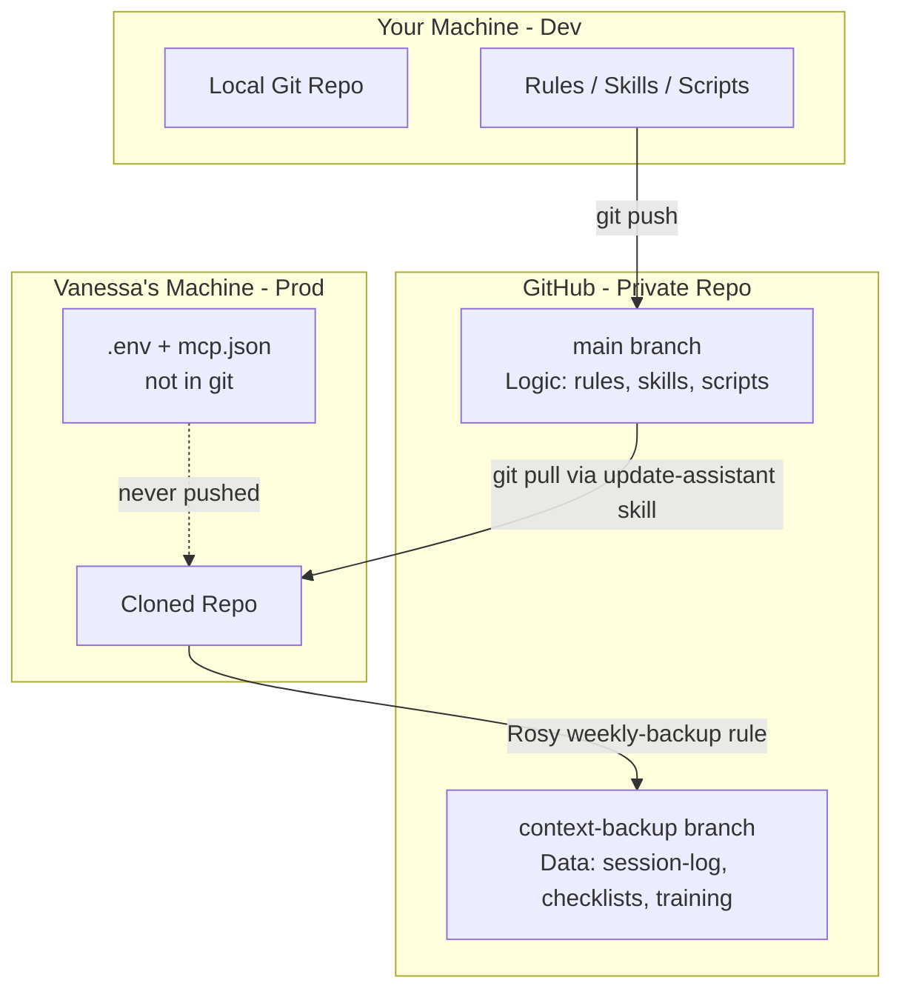

# Business OS — Phase 5 Implementation Plan

## Architecture Overview




---

## Gap Analysis

**Already done:**

- Git repo with 4 commits, correct `.gitignore` for secrets and context folders
- `scripts/` folder established

**Missing:**

- `mcp.json` is tracked in git and needs to be untracked (`git rm --cached`)
- No `mcp.json.example` as a tracked, safe template
- No `.env.example` as a credential reference
- `training/` is missing from `.gitignore` (should be context-branch data, not main)
- No `update-assistant` skill
- No `weekly-backup.mdc` rule
- No `setup.sh` bootstrap script
- No `SETUP_GUIDE.md` documentation for the full workflow

---

## Files to Create or Change

### 1. Untrack `mcp.json` and create `mcp.json.example`

Run: `git rm --cached .cursor/mcp.json`

Then create `.cursor/mcp.json.example` — a tracked, safe template mirroring the current structure with all values replaced by descriptive placeholders:

```json
{
  "mcpServers": {
    "mailchimp": {
      "command": "npx",
      "args": ["-y", "@fastmcp/mailchimp"],
      "env": {
        "MAILCHIMP_API_KEY": "YOUR_MAILCHIMP_API_KEY",
        "MAILCHIMP_SERVER_PREFIX": "us1_or_us2_etc"
      }
    },
    "woocommerce": {
      "command": "npx",
      "args": ["-y", "@fastmcp/woocommerce"],
      "env": {
        "WOO_URL": "https://your-site.com",
        "WOO_CONSUMER_KEY": "ck_your_key_here",
        "WOO_CONSUMER_SECRET": "cs_your_secret_here"
      }
    }
  }
}
```

`setup.sh` will copy this to `.cursor/mcp.json` on first run.

---

### 2. Create `.env.example`

A plain-text reference for all credentials the system needs. Used by `setup.sh` to guide initial setup:

```bash
# Mailchimp
MAILCHIMP_API_KEY=your_mailchimp_api_key_here
MAILCHIMP_SERVER_PREFIX=us1

# WordPress / WooCommerce (use an Application Password, not your admin login)
WOO_URL=https://your-site.com
WOO_CONSUMER_KEY=ck_your_key_here
WOO_CONSUMER_SECRET=cs_your_secret_here

# Google Drive (optional)
GOOGLE_DRIVE_CREDENTIALS_JSON=paste_json_string_here
```

---

### 3. Update `.gitignore`

Add `training/` to the "User-Specific Data" section so lesson notes stay on the context branch and off `main`.

---

### 4. Create `.cursor/skills/update-assistant/SKILL.md`

Triggered when Vanessa says "Update assistant", "Pull updates", or "Sync Rosy".

Workflow:

1. Present the command to Vanessa: `git pull --rebase origin main`
2. Wait for GREEN LIGHT
3. Run the pull
4. Report what changed (new skills, rule updates, script additions) by summarizing the git log diff
5. If `ASSISTANT_MANUAL.md` changed, highlight new or updated skills by name
6. Append to `session-log.md`: `| timestamp | ASSISTANT UPDATED | Pulled latest from main |`

---

### 5. Create `.cursor/rules/weekly-backup.mdc`

Always-apply rule. Triggers:

- Every Friday (Rosy detects date during Morning Brief)
- Any time Vanessa says "Back up" or "Save my work"

Workflow Rosy follows (presents as proposed commands, waits for GREEN LIGHT):

```bash
git checkout -B context-backup
git add checklists/ session-log.md training/ archive/
git commit -m "Context backup — YYYY-MM-DD"
git push origin context-backup
git checkout main
```

Rule also documents:

- What the context branch contains: Vanessa's operational data (logs, filled checklists, lessons, archived drafts)
- What stays on main: Rosy's logic (rules, skills, scripts, docs)
- If Vanessa accidentally deletes a draft, she can ask Rosy to restore it via `git checkout context-backup -- [filepath]`

---

### 6. Create `setup.sh`

A bash script run once on a new machine to bootstrap the full environment. Steps:

1. Check for required tools: `git`, `node`, `npm` — print clear error if missing
2. Copy `.cursor/mcp.json.example` → `.cursor/mcp.json` (if no `mcp.json` exists yet)
3. Copy `.env.example` → `.env` (if no `.env` exists yet)
4. Print instructions asking the user to fill in their credentials in `mcp.json` and `.env`
5. Install Node.js dependencies for scripts: `npm install` (creates a `package.json` if not present)
6. Print a final "Setup complete" summary with a link to `SETUP_GUIDE.md`

---

### 7. Create `SETUP_GUIDE.md`

Step-by-step documentation for the full Dev → GitHub → Vanessa's machine workflow:

- **Section 1: Your machine (one-time)** — create private GitHub repo, `git remote add origin`, `git push -u origin main`
- **Section 2: Vanessa's machine (one-time)** — `git clone [url]`, `cd business_assistant`, `./setup.sh`, fill in credentials
- **Section 3: Ongoing dev workflow** — edit rules/skills/scripts, commit, `git push`, Vanessa types "Update assistant"
- **Section 4: Context backup** — what Rosy commits, how to restore deleted files
- **Section 5: Starting fresh on a new machine** — same as Section 2

---

### 8. Update `CHANGELOG.md` — v0.5.0

---

## Two-Branch Model Summary


| What                                             | Branch                          | Who Manages                   |
| ------------------------------------------------ | ------------------------------- | ----------------------------- |
| Rules, skills, scripts, docs                     | `main`                          | You (developer) via git push  |
| Session log, checklists, training notes, archive | `context-backup`                | Rosy via `weekly-backup` rule |
| API keys, credentials                            | Local only (`.env`, `mcp.json`) | Never in git                  |


