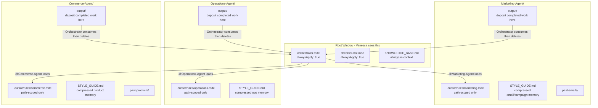

# Business OS — Phase 7 Implementation Plan

## Critical Assessment: Context Bloat

Before listing changes, this is the most important thing to understand about the current setup:

Every message Vanessa sends to Cursor includes all `alwaysApply: true` rules. Right now that is 4 always-on rule files. Adding more `alwaysApply: true` sub-agent rules would make every single "Hi" expensive. The solution is a **two-tier rule architecture**:

- **Tier 1 (always-on):** Orchestrator identity, review gate, checklist-bot — tiny and critical. These fire on every message.
- **Tier 2 (path-scoped):** Sub-agent specialist rules — fire only when Vanessa @-references an agent folder or opens files in it. Zero cost otherwise.

The other bloat killer is Cursor's background indexer. Without a root `.cursorignore`, Cursor reads and indexes every file in the tree for autocomplete and search. That is a hidden token cost that compounds over time.

---

## What Is NOT Being Built (And Why)

- **Git submodules per agent** — The current single-repo + context-backup branch strategy is correct. Submodules add developer overhead (multiple `git push` operations, broken submodule references) with zero benefit for Vanessa's use case.
- **Vector database MCP** — Premature for this scale. The `KNOWLEDGE_BASE.md` + per-agent `STYLE_GUIDE.md` pattern handles memory efficiently.
- **Python file watcher** — Future Puppeteer territory. Not needed until automated Canva/tax scripts are live.
- **Separate Cursor windows per agent** — Defeats the one-window purpose entirely.

---

## Architecture After Phase 7




---

## Changes to Make

### 1. Create root `.cursorignore`

This is the single highest-impact change. It tells Cursor's indexer what to ignore when scanning the workspace, directly reducing background token cost.

File: `.cursorignore` at workspace root.

```
# Agent sub-folders — load on demand via @-reference only
Commerce-Agent/past-products/
Commerce-Agent/output/
Marketing-Agent/past-emails/
Marketing-Agent/output/
Operations-Agent/output/

# Cold storage — never index
archive/

# Script dependencies
node_modules/
scripts/fetch-canva/
scripts/sales-tax/

# System
.git/
*.log
```

Note: This is distinct from `.gitignore`. `.cursorignore` only affects Cursor's indexer, not git tracking.

---

### 2. Create per-agent scoped rule files

Each agent gets its own `.cursor/rules/*.mdc` file inside its folder. These are `alwaysApply: false` and path-scoped — they only load when Vanessa explicitly @-references the agent or opens files in that directory. Zero token cost otherwise.

`**Commerce-Agent/.cursor/rules/commerce.mdc**`

- WooCommerce and WordPress specialist rules
- Always search `past-products/` before creating anything
- Naming conventions, shipping classes, tax status defaults
- Output draft to root `inbox/`, never directly to WooCommerce

`**Marketing-Agent/.cursor/rules/marketing.mdc**`

- Mailchimp and social media specialist rules
- Always search `past-emails/` before drafting
- Florida training event tone and style preferences
- Completed cross-agent work (flyers, copy for Commerce to use) deposits to `Marketing-Agent/output/` — the Orchestrator consumes and cleans up

`**Operations-Agent/.cursor/rules/operations.mdc**`

- Scheduling, tax, and SOP specialist rules
- Florida sales tax filing references
- SOP document format standards

---

### 3. Create per-agent `STYLE_GUIDE.md`

A single compressed reference file per agent. Instead of Rosy reading 50 past emails to learn the style, it reads one file. This is the "Compressed Memory" pattern from the conversation.

- `Commerce-Agent/STYLE_GUIDE.md` — product naming conventions, shipping classes, tax defaults, description format, image standards
- `Marketing-Agent/STYLE_GUIDE.md` — email tone, subject line format, CTA style, Florida audience notes, Mailchimp tag conventions
- `Operations-Agent/STYLE_GUIDE.md` — SOP format, scheduling preferences, tax filing notes

All three start as starter templates. The `compress-memory` skill (existing) should also update these when relevant lessons are learned.

---

### 4. Create per-agent `output/` sub-folders

Each agent deposits completed work in its own `output/` folder. The Orchestrator reads from there and triggers the next step. There is no shared TRANSIT directory — per-agent output avoids name collisions and makes ownership clear.

Folders created:

- `Commerce-Agent/output/` — products ready to push, website drafts
- `Marketing-Agent/output/` — campaign drafts, flyers, copy ready for Commerce to use
- `Operations-Agent/output/` — SOP drafts, tax prep outputs

Each folder gets a short `README.md` explaining the convention.

All three `output/` dirs are gitignored — they are ephemeral handoff zones, not historical records. Once the Orchestrator consumes a file, it is deleted (see Step 5 below).

---

### 5. Update `orchestrator.mdc` — grep-first + handoff consumption

Two targeted additions to the existing `## Context Efficiency` section:

**Grep-first search instruction:**

> When searching for past examples in `past-products/`, `past-emails/`, or any agent archive, use terminal `grep`/`rg` rather than reading individual files.
> Example: `rg 'shipping_class' Commerce-Agent/past-products/`
> This avoids loading dozens of files into context when a single search line suffices.

**Handoff consumption convention** (new `## Agent Handoff` section):

> When a file appears in any agent's `output/` folder, treat it as a handoff from that agent.
> After consuming the file (reading and acting on it), delete it from `output/` and log to `session-log.md`:
> `| timestamp | HANDOFF CONSUMED | [filename] from [Agent]/output/ |`
> The `output/` folders are ephemeral — they should always be empty when no handoff is in progress.

---

### 6. Fix `alwaysApply` on non-critical rules

`manual-maintenance.mdc` and `weekly-backup.mdc` are currently `alwaysApply: true`. They fire on every single message, adding ~100 lines of context on every "Hi". They should be `alwaysApply: false` — they only need to be active when Vanessa is explicitly doing maintenance or backup work.

Change in both files:

```yaml
alwaysApply: false
```

The orchestrator's Morning Brief already triggers the weekly backup check by date, so the behavior is preserved.

---

### 7. Update `CHANGELOG.md` — v0.7.0

---

## Summary of Files Created or Changed

- `.cursorignore` — NEW (root-level indexer exclusions)
- `Commerce-Agent/.cursor/rules/commerce.mdc` — NEW (path-scoped)
- `Commerce-Agent/STYLE_GUIDE.md` — NEW (compressed product memory)
- `Commerce-Agent/output/README.md` — NEW (handoff convention)
- `Marketing-Agent/.cursor/rules/marketing.mdc` — NEW (path-scoped)
- `Marketing-Agent/STYLE_GUIDE.md` — NEW (compressed campaign memory)
- `Marketing-Agent/output/README.md` — NEW (handoff convention)
- `Operations-Agent/.cursor/rules/operations.mdc` — NEW (path-scoped)
- `Operations-Agent/STYLE_GUIDE.md` — NEW (compressed ops memory)
- `Operations-Agent/output/README.md` — NEW (handoff convention)
- `.cursor/rules/orchestrator.mdc` — EDIT (grep-first search + handoff consumption convention)
- `.cursor/rules/manual-maintenance.mdc` — EDIT (`alwaysApply: false`)
- `.cursor/rules/weekly-backup.mdc` — EDIT (`alwaysApply: false`)
- `.gitignore` — EDIT (add per-agent `output/` dirs)
- `CHANGELOG.md` — EDIT (v0.7.0)

